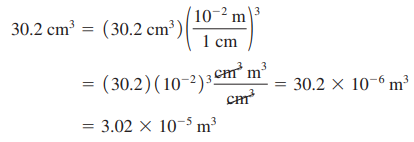

# ↔ Conversión de Unidades

## Tiempo

### Identificar los conceptos pertinentes

La conversión de unidades es importante, pero también lo es saber cuándo se requiere. En general, lo mejor es usar las unidades fundamentales del SI (longitudes en metros, masas en kilogramos y tiempo en segundos) dentro de un problema. Si la respuesta se debe dar en otras unidades (kilómetros, gramos u horas, por ejemplo), espere hasta el final para efectuar la conversión. En los ejemplos que siguen, nos concentraremos sólo en la conversión de unidades, así que omitiremos el paso Identificar.&#x20;

### Plantear el problema y Ejecutar la solución&#x20;

Las unidades se multiplican y se dividen igual que los símbolos algebraicos ordinarios. Esto facilita la conversión de una cantidad de un conjunto de unidades a otro. La idea clave es que podemos expresar la misma cantidad física en dos unidades distintas y formar una igualdad. Por ejemplo, al indicar que 1 min 5 60 s, no queremos decir que el número 1 sea igual al número 60, sino que 1 min representa el mismo intervalo de tiempo que 60 s. Por ello, el cociente (1 min)>(60 s) es igual a 1, lo mismo que su recíproco (60 s)>(1 min). Podemos multiplicar una cantidad por cualquiera de estos factores, sin alterar el significado físico de la misma. Por ejemplo, para averiguar cuántos segundos hay en 3 min, escribimos:

<figure><figcaption></figcaption></figure>

### Evaluar la respuesta&#x20;

Si convertimos las unidades correctamente, se eliminarán las unidades no deseadas, como en el ejemplo anterior. Si hubiéramos multiplicado 3 min por (1 min)>(60 s), el resultado habría sido 1/20 min^2/s, una forma un tanto rara de medir el tiempo. Para asegurarse de convertir bien las unidades, usted debe incluirlas en todas las etapas del cálculo.&#x20;


Por último, verifique si la respuesta es lógica. ¿El resultado _3 min = 180 s_ es razonable? La respuesta es sí; el segundo es más pequeño que el minuto, por lo que habrá más segundos que minutos en el mismo intervalo de tiempo.


## Rapidez

### Identificar y plantear&#x20;

Queremos convertir las unidades de rapidez de km>h a m>s.&#x20;

<figure><figcaption></figcaption></figure>

### Ejecutar&#x20;

El prefijo _k_ indica 10^3 , por lo que la rapidez:


_1228.0 km/h = 1228.0 X 10^3 m/h._&#x20;


Sabemos también que hay 3600 s en 1h, así que debemos combinar la rapidez de: _**1228.0 X 10^3 m/h**_ y un factor de 3600.&#x20;

Pero, ¿debemos multiplicar por este factor o dividir entre él? Si tratamos el factor como número sin unidades, tendríamos que adivinar para continuar. El enfoque correcto es incluir las unidades en el factor, el cual acomodaremos a modo de eliminar la unidad de horas:&#x20;

Si multiplicáramos por _**(3600s)/(1 h)**_ en vez de _**(1 h)/(3600 s)**_, las horas no se cancelarían, y sería fácil detectar el error. De nuevo, la única forma de estar seguro de haber convertido correctamente las unidades es llevarlas durante todo el cálculo.

### Evaluar

Aunque el lector seguramente tiene una buena idea de la magnitud de la rapideces expresadas en kilómetros por hora o en millas por hora, las rapideces en metros por segundo probablemente son un poco más misteriosas. Es útil recordar que al caminar la rapidez común es de _**1 m/s**_; que la longitud de cada paso de un adulto representativo es aproximadamente de un metro; y que un buen ritmo para caminar es de un paso por segundo. En comparación, ¡una rapidez de _**341.11 m/s**_ es en verdad elevada!

## Volumen&#x20;

El diamante tallado **más grande del mundo** es la Primera Estrella de África (montada en el cetro real británico y guardado en la Torre de Londres). Su volumen es de _1.84 pulgadas cúbicas_. ¿Cuál será su volumen en centímetros cúbicos? ¿Y en metros cúbicos?

### Identificar y plantear

Aquí debemos convertir las unidades de volumen de pulgadas cúbicas (in^3), a centímetros cúbicos (cm^3) y a metros cúbicos (m^3).&#x20;

### Ejecutar

Para convertir pulgadas cúbicas a centímetros cúbicos, multiplicamos por \[(2.54 cm)/(1 in)]^3 , no sólo (2.54 cm)/(1 in). Tenemos:

<figure><figcaption></figcaption></figure>

También, 1 cm = 10 ^ -2 m, y:

<figure><figcaption></figcaption></figure>

### Evaluar&#x20;

Mientras que 1 centímetro es 10 ^ -2 de un metro (es decir, 1 cm = 10 ^ -2 m), nuestra respuesta indica que un centímetro cúbico (1 cm^3 ) no es 1 ^ -2 de un metro cúbico. Más bien, es el volumen de un cubo cuyos lados tienen 1 cm de largo. Así:


1 cm^3 = (1 cm)^3 = (10^ -2 m)^3 = (10 ^ -2 )^3 m^3 , o bien, 1 cm^3 = 10^-6 m^3


