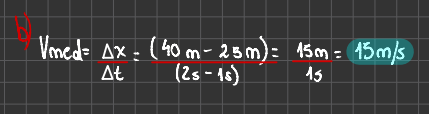

# Desplazamiento, Tiempo y Velocidad Media

## Desplazamiento

Una forma útil de describir el movimiento de la partícula es en términos del cambio en su coordenada X durante un intervalo de tiempo.

Supongamos que una partícula parte del reposo, y 1.0s después del arranque, está en el punto _P1_ a 19m del origen, y que 4.0s después está en el punto _P2_ a 277m del origen.

<figure><figcaption></figcaption></figure>


El _desplazamiento_ de la partícula es un vector que apunta de _P1 a P2._ En la imagen de arribase muestra que este vector apunta a lo largo del eje X.


&#x20;La componente _x_ es el cambio en el valor de _x_ (277m - 19m) = 258m, que hubo en un lapso de (4.0s - 1.0s) = 3.0s.

## Velocidad

### Velocidad Media

Definimos **velocidad media** de una partícula durante este intervalo de tiempo como una cantidad _vectorial_, cuya componente _x_ es el cambio en _x_ dividido entre el intervalo de tiempo:

<figure><figcaption></figcaption></figure>

En general, la velocidad media depende del intervalo de tiempo elegido. Durante un lapso de 3.0 s _antes_ del arranque, la velocidad media fue cero, porque el auto estaba en reposo en la línea de salida y tuvo un desplazamiento cero.


<mark style="color:red;">CUIDADO</mark>

## <mark style="color:red;">El significado de Δx</mark>

&#x20;**** No es el producto de Δ y **x;** es solo un símbolo que significa "el cambio en la cantidad **x**"  ****  Siempre se usa la letra griega mayúscula Δ (delta) para representar un _cambio_ en cierta cantidad, calculada restado el valor _inicial_ del valor _final_, y nunca a la inversa. Asimismo, el intervalo de tiempo de _t1 y t2_ es Δt, el cambio de la cantidad _t: Δt = t2 - t1_ (tiempo final menos tiempo inicial) __&#x20;


La componente _x_ de la velocidad promedio, o **velocidad media**, es la componente _x_ del desplazamiento, _Δx_, dividida entre el intervalo de tiempo _Δt_ en el que ocurre el desplazamiento. Usamos el símbolo **Vmed-x** para representar velocidad media.

<figure><figcaption></figcaption></figure>

<figure><figcaption></figcaption></figure>

En el ejemplo de la partícula, teníamos que _x1 = 19m, x2 = 277m, t1 = 1.0s y t2 = 4.0s._ Así que la ecuación da: __&#x20;

<figure><figcaption></figcaption></figure>

La velocidad media del auto es positiva. Esto significa que, durante el intervalo, la coordenada _x_ aumentó y el auto se movió en la dirección +x.


Siempre que _x_ sea positiva y aumente o sea negativa y se vuelva menos negativa, la partícula se mueve en la dirección +x y **Vmed-x** es positiva. Siempre que x sea positiva y disminuya, o sea negativa y se vuelva más negativa, la partícula se mueve en la dirección -x y **Vmed-x** es negativa.


<figure><figcaption></figcaption></figure>


<mark style="color:orange;">CUIDADO</mark>

## <mark style="color:orange;">Elección de dirección</mark> <mark style="color:orange;"></mark>_<mark style="color:orange;">x</mark>_ <mark style="color:orange;"></mark><mark style="color:orange;">positiva</mark>

No sucumba a la tentación de pensar que una velocidad media positiva implica necesariamente movimiento a la derecha, con en la figura del auto, y una velocidad media negativa implica movimiento a la izquierda, como en la figura de la camioneta.

Tales conclusiones son correctas sólo si la dirección _+x_ es hacia la derecha, como elegimos en las figuras pasadas. Igualmente podríamos haber decidido que la dirección _+x_ fuera hacia la izquierda, con el origen en la llegada.


### Velocidad Instantánea

La velocidad media de una partícula durante un intervalo de tiempo no nos indica con qué rapidez, o en qué dirección, la partícula se estaba moviendo en un instante dado del intervalo. Para describir el movimiento con mayor detalle, necesitamos definir la velocidad en cualquier instante específico o punto específico del camino. Ésta es la **velocidad instantánea**, y debe definirse con cuidado.

Para obtener la velocidad instantánea del auto en los ejemplos pasados en el punto _P1,_ movemos el segundo punto _P2_ cada vez más cerca de _P1_ y calculamos la velocidad media _Vmed-x = Δx/Δt_ para estos desplazamientos y lapsos cada vez más cortos. Tanto Δx y Δt se hacen más pequeños pero su cociente necesariamente no lo hace.


_La velocidad instantánea es el límite de la velocidad media conforme el intervalo de tiempo se acerca a cero; es igual a la tasa instantánea de cambio de posición con el tiempo._


<figure><figcaption>
Fórmula dela Velocidad Instantánea
</figcaption></figure>


<mark style="color:orange;">CUIDADO</mark>

## <mark style="color:orange;">Rapidez media y velocidad media</mark>

La rapidez media no es la magnitud de la velocidad media.



## Ejercicio

Un guepardo acecha 20 m al este del escondite de un observador. En el tiempo t = 0, el guepardo ataca a un antílope y empieza a correr en línea recta. Durante los primeros _2.0 s_ del ataque, la coordenada _x_ del guepardo varía con el tiempo según la ecuación _**x = 20 m + (5.0 m/s^2 )t^2.**_&#x20;

* a) Obtenga el desplazamiento del guepardo entre t1 = 1.0s y t2 = 2.0s.&#x20;
* b) Calcule la velocidad media en dicho intervalo.
* c) Calcule la velocidad instantánea en t1 = 1.0s tomando Δt = 0.1 s, luego Δt = 0.01 s, luego Δt = 0.001 s.&#x20;
* d) Deduzca una expresión general para la velocidad instantánea en función del tiempo, y con ella calcule Vx en t = 1.0s y t = 2.0s.

<figure><figcaption>
Ilustración del ejercicio propuesto.
</figcaption></figure>

### Solución

#### Inciso a)

<figure><figcaption></figcaption></figure>

#### Inciso b)

<figure><figcaption></figcaption></figure>

#### Inciso c)

<figure><figcaption></figcaption></figure>

#### Inciso d)

<figure><figcaption></figcaption></figure>
